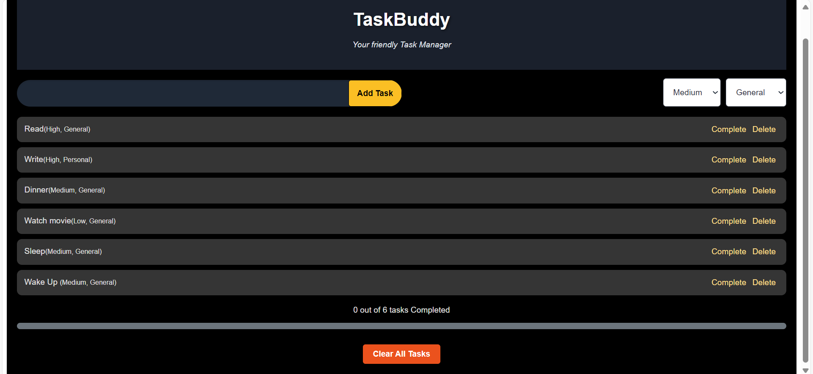

# 📝 TaskBuddy

**TaskBuddy** is a sleek and efficient task management web app built with **ReactJS**. It enables users to manage daily tasks with ease — add, edit, delete, and track progress of all your tasks with a user-friendly interface.

 <!-- Replace this with actual image path if hosted -->

---

## 🚀 Features

- **Add Task** – Instantly add tasks with priority and category.
- **Delete** – Remove tasks individually.
- **Clear All Tasks** – One-click delete all tasks.
- **Progress Tracker** – Real-time progress bar to track task completion.
- **Complete** - One-click to complete the task individually.
- **Undo** - One-click to undo the task. 
---

## 📸 Screenshot


---

## 🛠️ Tech Stack

- ⚛️ ReactJS
- JavaScript (ES6)
- HTML5 + CSS3

---

## 📦 Installation

To run this project locally:

```bash
# Clone the repo
git clone https://github.com/Chandan-39/TaskBuddy_Project.git

# Go into the project folder
cd TaskBuddy_Project

# Install dependencies
npm install

# Start the development server
npm start


